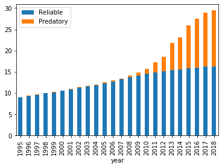

### Background

One of the most amazing things about the response to the COVID-19 pandemic has been theamount of research released on extremely short timelines. While this is an incredible human accomplishment, the generation of this much science exacerbates an existing problem facing many scientific researchers: it is often impossible to read every piece of potentially relevant research while still maintaining a productive output in the lab.

This problem is made even worse by the existence of low quality science (whether intentionally fraudulent or simply careless) which must be waded through in order to find useful work. Ideally, it is the role of peer reviewed journals to solve this problem (though this process is [not perfect](https://statmodeling.stat.columbia.edu/2020/06/15/surgisphere-scandal-legacy-media-lancet-still-dont-get-it/) and journals are not without other flaws). However, simply publishing something in a professional journal is no guarantee that it is not ‘garbage science’. In fact, this whole project of evaluating the COVID-19 literature was inspired for me by [this graphic](https://www.economist.com/graphic-detail/2020/05/30/how-to-spot-dodgy-academic-journals) from the economist (recreated below), which shows that ~40% of the journals existing in 2018 were essentially little more than pay to publish scams! And this number has been growing since 2010! Clearly there is a market for writing and publishing junk science, and I see no reason why coronavirus related research would be exempt from this trend.

Most researchers are aware of the reputable journals in their own fields, and so are unlikely to waste time reading work printed in this type of predatory journal. However there has been a trend in the scientific community generally (and the pandemic community particularly) towards getting the latest science from preprint servers like MedRxiv or BioRxiv. These manuscripts have not yet been through peer review, and so there is no filter in place separating quality research from junk.

This is a potential disaster. It's not always trivial to spot bad science, and countless hours could be wasted on this process that could be spent in much more productive ways. Not to mention the cases where such work is [both fraudulent and actively harmful](https://www.thelancet.com/journals/lancet/article/PIIS0140-6736(20)31180-6/).

